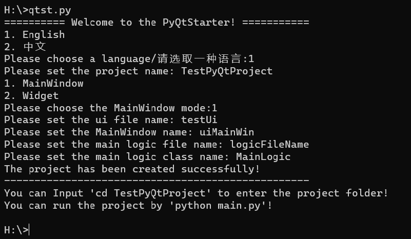

# PyQtStarter

语言： [English]()     [简体中文](README_zh.md)    

## 1.Introduction

**PyQtStarter is a CLI that helps you create a maintainable, decoupled project directory**

If you want to create a highly maintainable PyQt5 project, a good project directory is essential. In C++, projects can be created by guidance  in **QtCreator**, but PyQt5 does not have this guidance. So I made the pyqt project startup CLI by combining my own experience in developing projects, following the steps in **QtCreator** and taking inspiration from the way **Django** creates projects.

## 2 Usage method

### 2.1 Cloning or downloading the repository

### 2.2 Adding a project directory to the PATH

### 2.3 (Optional) Rename main.py, for example, qtst.py

### 2.4 On the CLI, enter 'python qtst.py' to start the program

```bash
python qtst.py
```

### 2.5 Detailed Settings



#### 2.5.1 Setting the Project Name

Set the name of the project you want to create. This program will create the project folder from the current command line path as the root directory

#### 2.5.2 Setting the UI File Name

Set the name of the '.ui' file you want. The program will create a '.ui' file named by you in the 'project/ui' directory

#### 2.5.3 Selecting the Main Window Mode

The main window modes available are:
1.MainWindow- A full Windows UI style window
2.Widget- A pure panel or blank container called a control

#### 2.5.4 Setting the Name of the Main Window

Set the name you want for the main window of the interface, noting that the name here is the type name of the window, not the window title

#### 2.5.5 Setting the File Name of the Logical Code

Set the file name of the logical code you want, which will be involved in importing and calling between modules

#### 2.5.6 Setting the Logical Code Class Name

Set the class name of the logic code you want, which involves importing and calling between modules. Try to follow the Python naming conventions for class names

#### 2.5.7 The directory structure of the project


### 3 Run it

#### 3.1 Use the command 'cd prpjectname' to access the project folder

```bash
cd <ProjectName>
```

#### 3.2 Run the 'python main.py' command to start the project

```bash
python main.py
```
## 4. Other tips

This project is based on personal experience, so it is impossible to meet the needs of all developers, so please do your best to contribute to this project, thank you!


