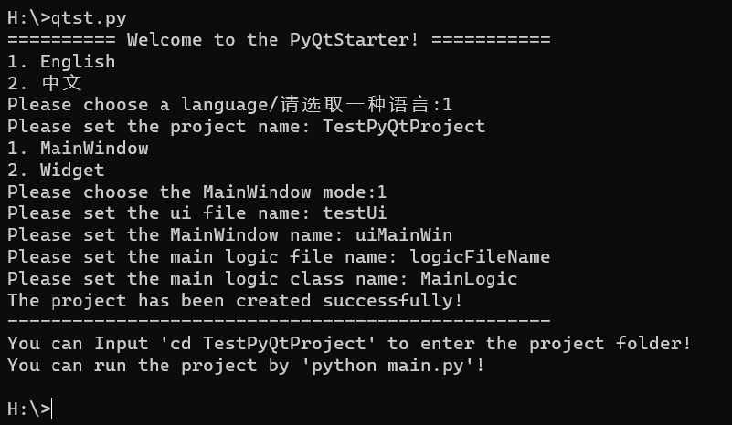
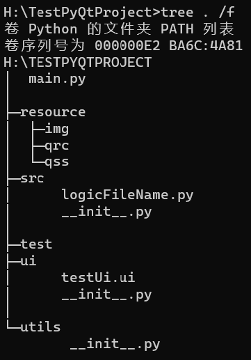

# PyQtStarter

语言： [English]()     [简体中文]()    

## 1 项目介绍

如果你想创建一个维护性高的pyqt5项目，那么一个好的项目目录必不可少。在c++环境下，QtCreator中可以根据引导创建项目，但是PyQt没有这种引导。于是我结合自己开发项目的经验，并且仿照QtCreator中引导的步骤，还从Django创建项目的方式那里获取灵感，制作了这个pyqt项目启动脚手架。

## 2 使用方法

### 2.1 克隆或下载此存储库

### 2.2 将项目目录添加到PATH中

### 2.3（选做） 将main.py重命名，例如qtst.py

### 2.4 在命令行中输入‘qtstart.py’启动程序

```bash
python qtst.py
```

### 2.5详细设置



#### 2.5.1 设置项目名称

设置您想要创建的项目的名称，本程序会以命令行当前路径为根目录创建项目文件夹

#### 2.5.2 设置UI文件名

设置您想要的'.ui'文件的文件名，本程序将会在 'project/ui' 目录下创建一个您命名的'.ui'文件

#### 2.5.3 选择主窗口模式

可供选择的主窗口模式有：
1.MainWindow-一个完整的Windows UI风格的窗口
2.Widget-一个纯粹的面板或者称为一个控件的空白容器

#### 2.5.4 设置主窗口的名称

设置您希望的界面主窗口的名称，注意此处的名称是窗口的类型名称，而不是窗口标题

#### 2.5.5 设置逻辑代码文件名

设置您希望的逻辑代码的文件名，这将涉及到模块间的引入和调用

#### 2.5.6 设置逻辑代码类名

设置您希望的逻辑代码的类名，这将涉及到模块间的引入和调用，命名请尽量符合Python类名命名规范

#### 2.5.7 生成的项目目录结构



## 3 启动

### 3.1 使用命令 ’cd PrpjectName‘ 进入项目文件夹

```bash
cd <ProjectName>
```

### 3.2 执行 ‘python main.py’命令 启动项目

```bash
python main.py
```

## 4 其他说明

本项目的设想由个人经验出发，因此不可能满足所有开发者的需求，所以请您倾力为本项目贡献，谢谢！